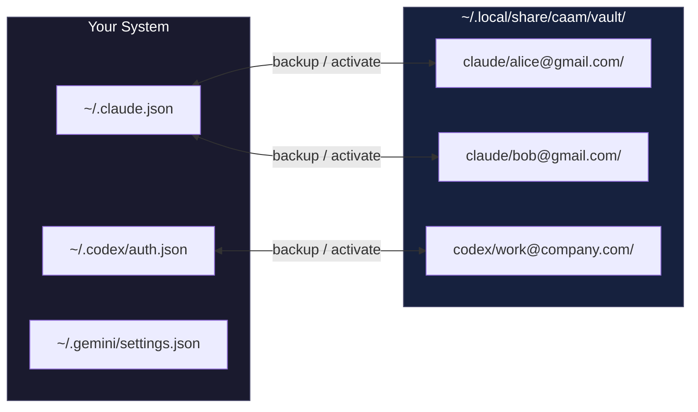

# caam - Coding Agent Account Manager


> **Sub-100ms account switching for AI coding CLIs. When you hit usage limits, don't wait 60 seconds for browser OAuth—just swap auth files instantly.**

```bash
# Install
curl -fsSL "https://raw.githubusercontent.com/Dicklesworthstone/coding_agent_account_manager/main/install.sh?$(date +%s)" | bash

# Use
caam backup claude alice@gmail.com      # Save current auth
caam activate claude bob@gmail.com      # Switch instantly
```

---

## The Problem

You're deep in flow, Claude Max shows a rate limit. The official way to switch accounts:

```
/login → browser opens → sign out of Google → sign into different Google →
authorize app → wait for redirect → back to terminal
```

**That's 30-60 seconds of friction.** Multiply by 5+ switches per day across multiple tools.

## The Solution

Each AI CLI stores OAuth tokens in plain files. `caam` backs them up and restores them:

```bash
caam activate claude bob@gmail.com   # ~50ms, done
```

No browser. No OAuth dance. No interruption to your flow state.

---

## How It Works



**That's it.** No daemons, no databases, no network calls. Just `cp` with extra steps.

### Why This Works

OAuth tokens are bearer tokens—possession equals access. The CLI tools don't fingerprint your machine beyond what's already in the token file. Swapping files is equivalent to "being" that authenticated session.

### Profile Detection

`caam status` uses **content hashing** to detect the active profile:

1. SHA-256 hash current auth files
2. Compare against all vault profiles
3. Match = that's what's active

This means:
- Profiles are detected even if you switched manually
- No hidden state files that can desync
- Works correctly after reboots

---

## Two Operating Modes

### 1. Vault Profiles (Simple Switching)

Swap auth files in place. One account active at a time per tool. Instant switching.

```bash
caam backup claude work@company.com
caam activate claude personal@gmail.com
```

**Use when:** You want to switch between accounts sequentially (most common use case).

### 2. Isolated Profiles (Parallel Sessions)

Run multiple accounts **simultaneously** with full directory isolation.

```bash
caam profile add codex work@company.com
caam profile add codex personal@gmail.com
caam exec codex work@company.com -- "implement feature X"
caam exec codex personal@gmail.com -- "review code"
```

Each profile gets its own `$HOME` and `$CODEX_HOME` with symlinks to your real `.ssh`, `.gitconfig`, etc.

**Use when:** You need two accounts running at the same time in different terminals.

---

## Supported Tools

| Tool | Auth Location | Login Command |
|------|--------------|---------------|
| **Claude Code** | `~/.claude.json` + `~/.config/claude-code/auth.json` | `/login` in CLI |
| **Codex CLI** | `~/.codex/auth.json` | `codex login` |
| **Gemini CLI** | `~/.gemini/settings.json` | Interactive prompt |

### Claude Code (Claude Max)

**Subscription:** Claude Max ($100/month for 5x usage)

**Auth Files:**
- `~/.claude.json` — Main authentication token
- `~/.config/claude-code/auth.json` — Secondary auth data

**Login Command:** Inside Claude Code, type `/login`

**Notes:** Claude Max has a 5-hour rolling usage window. When you hit it, you'll see rate limit messages. Switch accounts to continue.

### Codex CLI (GPT Pro)

**Subscription:** GPT Pro ($200/month unlimited)

**Auth Files:**
- `~/.codex/auth.json` (or `$CODEX_HOME/auth.json`)

**Login Command:** `codex login`

**Notes:** Respects `CODEX_HOME` environment variable for custom locations.

### Gemini CLI (Google One AI Premium)

**Subscription:** Google One AI Premium ($20/month)

**Auth Files:**
- `~/.gemini/settings.json`

**Login Command:** Start `gemini`, select "Login with Google"

---

## Quick Start

### 1. Backup Your Current Account

```bash
# After logging into Claude normally
caam backup claude alice@gmail.com
```

### 2. Add Another Account

```bash
caam clear claude                        # Remove current auth
claude                                   # Login as bob@gmail.com via /login
caam backup claude bob@gmail.com         # Save it
```

### 3. Switch Instantly

```bash
caam activate claude alice@gmail.com     # Back to Alice
caam activate claude bob@gmail.com       # Back to Bob
```

### 4. Check Status

```bash
$ caam status
claude: alice@gmail.com (active)
codex:  work@company.com (active)
gemini: (no auth files)

$ caam ls claude
alice@gmail.com
bob@gmail.com
carol@gmail.com
```

---

## Command Reference

### Auth File Swapping (Primary Use Case)

| Command | Description |
|---------|-------------|
| `caam backup <tool> <email>` | Save current auth files to vault |
| `caam activate <tool> <email>` | Restore auth files from vault (instant switch!) |
| `caam status [tool]` | Show which profile is currently active |
| `caam ls [tool]` | List all saved profiles in vault |
| `caam delete <tool> <email>` | Remove a saved profile |
| `caam paths [tool]` | Show auth file locations for each tool |
| `caam clear <tool>` | Remove auth files (logout state) |

**Aliases:** `caam switch` and `caam use` work like `caam activate`

### Stealth Mode (Optional)

| Command | Description |
|---------|-------------|
| `caam cooldown set <provider/profile> [--minutes N]` | Record a limit hit and enforce a cooldown for that profile |
| `caam cooldown list` | List active cooldowns |
| `caam cooldown clear <provider/profile>` | Clear cooldowns for a specific profile |
| `caam cooldown clear --all` | Clear all cooldowns |
| `caam activate <tool> --auto` | Auto-select a profile using the configured rotation algorithm |

When `stealth.cooldown.enabled` is true, `caam activate` warns (and can block) if the target profile is still in cooldown. Use `caam activate <tool> <profile> --force` to override.

When `stealth.rotation.enabled` is true, `caam activate <tool>` can fall back to rotation if there’s no default profile, and it will try to pick an alternative profile if the default is in cooldown.

### Profile Isolation (Advanced)

| Command | Description |
|---------|-------------|
| `caam profile add <tool> <email>` | Create isolated profile directory |
| `caam profile ls [tool]` | List isolated profiles |
| `caam profile delete <tool> <email>` | Delete isolated profile |
| `caam profile status <tool> <email>` | Show isolated profile status |
| `caam login <tool> <email>` | Run login flow for isolated profile |
| `caam exec <tool> <email> [-- args]` | Run CLI with isolated profile |

---

## Workflow Examples

### Daily Workflow

```bash
# Morning: Check what's active
caam status
# claude: alice@gmail.com (active)
# codex:  work@company.com (active)
# gemini: personal@gmail.com (active)

# Afternoon: Hit Claude usage limit
caam activate claude bob@gmail.com
# Activated claude profile 'bob@gmail.com'

claude  # Continue working immediately with new account
```

### Initial Multi-Account Setup

```bash
# 1. Login to first account using normal flow
claude
# Inside Claude: /login → authenticate with alice@gmail.com

# 2. Backup the auth using the email as the profile name
caam backup claude alice@gmail.com

# 3. Clear and login to second account
caam clear claude
claude
# Inside Claude: /login → authenticate with bob@gmail.com

# 4. Backup that too
caam backup claude bob@gmail.com

# 5. Now you can switch instantly forever!
caam activate claude alice@gmail.com   # < 100ms
caam activate claude bob@gmail.com     # < 100ms
```

### Parallel Sessions Setup

```bash
# Create isolated profiles
caam profile add codex work@company.com
caam profile add codex personal@gmail.com

# Login to each (one-time, uses browser)
caam login codex work@company.com      # Opens browser for work account
caam login codex personal@gmail.com    # Opens browser for personal account

# Run simultaneously in different terminals
caam exec codex work@company.com -- "implement auth system"
caam exec codex personal@gmail.com -- "review PR #123"
```

---

## Vault Structure

```
~/.local/share/caam/
├── vault/                          # Saved auth profiles
│   ├── claude/
│   │   ├── alice@gmail.com/
│   │   │   ├── .claude.json        # Backed up auth
│   │   │   ├── auth.json           # From ~/.config/claude-code/
│   │   │   └── meta.json           # Timestamp, original paths
│   │   └── bob@gmail.com/
│   │       └── ...
│   ├── codex/
│   │   └── work@company.com/
│   │       └── auth.json
│   └── gemini/
│       └── personal@gmail.com/
│           └── settings.json
│
└── profiles/                       # Isolated profiles (advanced)
    └── codex/
        └── work@company.com/
            ├── profile.json        # Profile metadata
            ├── codex_home/         # Isolated CODEX_HOME
            │   └── auth.json
            └── home/               # Pseudo-HOME with symlinks
                ├── .ssh -> ~/.ssh
                └── .gitconfig -> ~/.gitconfig
```

---

## FAQ

**Q: Is this against terms of service?**

No. You're using your own legitimately-purchased subscriptions. `caam` just manages local auth files—it doesn't share accounts, bypass rate limits, or modify API traffic. Each account still respects its individual usage limits.

**Q: What if the tool updates and changes auth file locations?**

Run `caam paths` to see current locations. If they change in a tool update, we'll update `caam`. File an issue if you notice a discrepancy.

**Q: Can I sync the vault across machines?**

Don't. Auth tokens often contain machine-specific identifiers (device IDs, etc.). Backup and restore on each machine separately. Don't copy vault directories between machines.

**Q: What's the difference between vault profiles and isolated profiles?**

- **Vault profiles** (`backup`/`activate`): Swap auth files in place. Simple, instant, one account active at a time per tool.
- **Isolated profiles** (`profile add`/`exec`): Full directory isolation with pseudo-HOME. Run multiple accounts simultaneously in parallel terminals.

**Q: Will this break my existing sessions?**

Switching profiles while a CLI is running may cause auth errors in the running session. Best practice: switch accounts before starting a new session, not during.

**Q: How do I know which account I'm currently using?**

Run `caam status`. It shows the active profile (email) for each tool based on content hash matching.

---

## Installation

### One-liner (Recommended)

```bash
curl -fsSL "https://raw.githubusercontent.com/Dicklesworthstone/coding_agent_account_manager/main/install.sh?$(date +%s)" | bash
```

### From Source

```bash
git clone https://github.com/Dicklesworthstone/coding_agent_account_manager
cd coding_agent_account_manager
go build -o caam ./cmd/caam
sudo mv caam /usr/local/bin/
```

### Go Install

```bash
go install github.com/Dicklesworthstone/coding_agent_account_manager/cmd/caam@latest
```

---

## Tips

1. **Use the actual email address as the profile name** — it's self-documenting and you'll never forget which account is which
2. **Backup before clearing:** `caam backup claude current@email.com && caam clear claude`
3. **Check status often:** `caam status` shows what's active across all tools
4. **Use --backup-current flag:** `caam activate claude new@email.com --backup-current` auto-saves current state before switching

---

## Acknowledgments

Special thanks to **[@darvell](https://github.com/darvell)** for inspiring this project and for the feature ideas behind Smart Profile Management. His work on **[codex-pool](https://github.com/darvell/codex-pool)**—a sophisticated proxy that load-balances requests across multiple AI accounts with automatic failover—demonstrated how much intelligence can be added to account management.

While codex-pool answers "which account should handle THIS request?" (real-time proxy), caam answers "which account should I USE for my work session?" (profile manager). The upcoming Smart Profile Management features adapt codex-pool's intelligence to caam's architecture:

- **Proactive Token Refresh** — Refresh OAuth tokens before they expire, preventing mid-session auth failures
- **Profile Health Scoring** — Visual indicators (🟢🟡🔴) showing token status, error history, and plan type
- **Usage Analytics** — Track activation patterns and session durations across profiles
- **Hot Reload** — TUI auto-refreshes when profiles are added/modified in another terminal
- **Project-Profile Associations** — Remember which profile to use for each project directory

See [`docs/SMART_PROFILE_MANAGEMENT.md`](docs/SMART_PROFILE_MANAGEMENT.md) for the full design document.

---

## License

MIT
