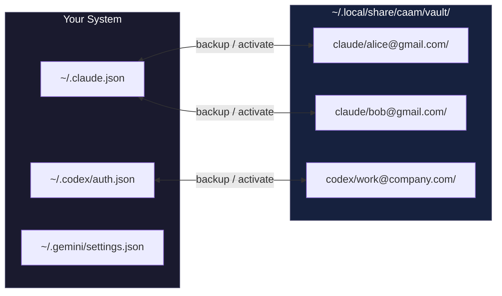

# caam - Coding Agent Account Manager


> **Sub-100ms account switching for AI coding CLIs with fixed-cost subscription plans. When you hit usage limits on Claude Max, GPT Pro, or Gemini Ultra, don't wait 60 seconds for browser OAuth—just swap to another account instantly.**

```bash
# Install
curl -fsSL "https://raw.githubusercontent.com/Dicklesworthstone/coding_agent_account_manager/main/install.sh?$(date +%s)" | bash

# Use
caam backup claude alice@gmail.com      # Save current auth
caam activate claude bob@gmail.com      # Switch instantly
```

---

## The Problem

You're paying $200-275/month for fixed-cost AI coding subscriptions (Claude Max, GPT Pro, Gemini Ultra). These plans have usage limits—not billing caps, but rate limits that reset over time. When you hit them mid-flow, the official way to switch accounts:

```
/login → browser opens → sign out of Google → sign into different Google →
authorize app → wait for redirect → back to terminal
```

**That's 30-60 seconds of friction.** Multiply by 5+ switches per day across multiple tools.

## The Solution

Each AI CLI stores OAuth tokens in plain files. `caam` backs them up and restores them:

```bash
caam activate claude bob@gmail.com   # ~50ms, done
```

No browser. No OAuth dance. No interruption to your flow state.

---

## How It Works



**That's it.** No daemons, no databases, no network calls. Just `cp` with extra steps.

### Why This Works

OAuth tokens are bearer tokens—possession equals access. The CLI tools don't fingerprint your machine beyond what's already in the token file. Swapping files is equivalent to "being" that authenticated session.

### Profile Detection

`caam status` uses **content hashing** to detect the active profile:

1. SHA-256 hash current auth files
2. Compare against all vault profiles
3. Match = that's what's active

This means:
- Profiles are detected even if you switched manually
- No hidden state files that can desync
- Works correctly after reboots

---

## Two Operating Modes

### 1. Vault Profiles (Simple Switching)

Swap auth files in place. One account active at a time per tool. Instant switching.

```bash
caam backup claude work@company.com
caam activate claude personal@gmail.com
```

**Use when:** You want to switch between accounts sequentially (most common use case).

### 2. Isolated Profiles (Parallel Sessions)

Run multiple accounts **simultaneously** with full directory isolation.

```bash
caam profile add codex work@company.com
caam profile add codex personal@gmail.com
caam exec codex work@company.com -- "implement feature X"
caam exec codex personal@gmail.com -- "review code"
```

Each profile gets its own `$HOME` and `$CODEX_HOME` with symlinks to your real `.ssh`, `.gitconfig`, etc.

**Use when:** You need two accounts running at the same time in different terminals.

---

## Supported Tools

| Tool | Auth Location | Login Command |
|------|--------------|---------------|
| **Claude Code** | OAuth: `~/.claude.json` + `~/.config/claude-code/auth.json` • API key: `~/.claude/settings.json` | `/login` in CLI |
| **Codex CLI** | `~/.codex/auth.json` (file store enforced) | `codex login` (or `--device-auth`) |
| **Gemini CLI** | OAuth: `~/.gemini/settings.json` (+ `oauth_credentials.json`) • API key: `~/.gemini/.env` | `gemini` interactive |

### Claude Code (Claude Max)

**Subscription:** Claude Max ($200/month)

**Auth Files:**
- `~/.claude.json` — Main authentication token
- `~/.config/claude-code/auth.json` — Secondary auth data
- `~/.claude/settings.json` — API key mode via `apiKeyHelper`

**Login Command:** Inside Claude Code, type `/login`

**Notes:** Claude Max has a 5-hour rolling usage window. When you hit it, you'll see rate limit messages. Switch accounts to continue.

### Codex CLI (GPT Pro)

**Subscription:** GPT Pro ($200/month unlimited)

**Auth Files:**
- `~/.codex/auth.json` (or `$CODEX_HOME/auth.json`)

**Login Command:** `codex login` (or `codex login --device-auth` for headless)

**Notes:** Respects `CODEX_HOME`. CAAM enforces file-based auth storage by writing `cli_auth_credentials_store = "file"` to `~/.codex/config.toml` inside the profile.

### Gemini CLI (Google One AI Premium)

**Subscription:** Gemini Ultra ($275/month)

**Auth Files:**
- `~/.gemini/settings.json`
- `~/.gemini/oauth_credentials.json` (OAuth cache)
- `~/.gemini/.env` (API key mode)

**Login Command:** Start `gemini`, select "Login with Google" or use `/auth` to switch modes

**Notes:** For CAAM, Gemini Ultra behaves like Claude Max and GPT Pro: OAuth tokens are stored locally and can be swapped instantly.

---

## Quick Start

### 1. Backup Your Current Account

```bash
# After logging into Claude normally
caam backup claude alice@gmail.com
```

### 2. Add Another Account

```bash
caam clear claude                        # Remove current auth
claude                                   # Login as bob@gmail.com via /login
caam backup claude bob@gmail.com         # Save it
```

### 3. Switch Instantly

```bash
caam activate claude alice@gmail.com     # Back to Alice
caam activate claude bob@gmail.com       # Back to Bob
```

### 4. Check Status

```bash
$ caam status
claude: alice@gmail.com (active)
codex:  work@company.com (active)
gemini: (no auth files)

$ caam ls claude
alice@gmail.com
bob@gmail.com
carol@gmail.com
```

---

## Command Reference

### Auth File Swapping (Primary Use Case)

| Command | Description |
|---------|-------------|
| `caam backup <tool> <email>` | Save current auth files to vault |
| `caam activate <tool> <email>` | Restore auth files from vault (instant switch!) |
| `caam status [tool]` | Show which profile is currently active |
| `caam ls [tool]` | List all saved profiles in vault |
| `caam delete <tool> <email>` | Remove a saved profile |
| `caam paths [tool]` | Show auth file locations for each tool |
| `caam clear <tool>` | Remove auth files (logout state) |
| `caam uninstall` | Restore originals from `_original` and remove caam data/config |

**Aliases:** `caam switch` and `caam use` work like `caam activate`

### Smart Profile Management

| Command | Description |
|---------|-------------|
| `caam activate <tool> --auto` | Auto-select the best profile using rotation algorithm |
| `caam next <tool>` | Preview which profile rotation would select (dry-run) |
| `caam run <tool> [-- args]` | Wrap CLI execution with automatic failover on rate limits |
| `caam cooldown set <provider/profile>` | Mark profile as rate-limited (default: 60min cooldown) |
| `caam cooldown list` | List active cooldowns with remaining time |
| `caam cooldown clear <provider/profile>` | Clear cooldown for a specific profile |
| `caam cooldown clear --all` | Clear all active cooldowns |
| `caam project set <tool> <profile>` | Associate current directory with a profile |
| `caam project get [tool]` | Show project associations for current directory |

**Options for `caam run`:**
- `--max-retries N` — Maximum retry attempts on rate limit (default: 1)
- `--cooldown DURATION` — Cooldown duration after rate limit (default: 60m)
- `--algorithm NAME` — Rotation algorithm: smart, round_robin, random
- `--quiet` — Suppress profile switch notifications

**Options for `caam activate`:**
- `--auto` — Use rotation algorithm to pick best profile
- `--backup-current` — Backup current auth before switching
- `--force` — Activate even if profile is in cooldown

When `stealth.cooldown.enabled` is true in config, `caam activate` warns if the target profile is in cooldown and prompts for confirmation. Use `--force` to bypass.

When `stealth.rotation.enabled` is true, `caam activate <tool>` automatically falls back to rotation if the default profile is in cooldown.

### Uninstall Notes

`caam uninstall` restores auth from any available `_original` backups first, then removes caam’s data/config. Useful flags:

- `--dry-run` shows what would be restored/removed
- `--keep-backups` keeps the vault after restoring originals
- `--force` skips the confirmation prompt

### Profile Isolation (Advanced)

| Command | Description |
|---------|-------------|
| `caam profile add <tool> <email>` | Create isolated profile directory |
| `caam profile ls [tool]` | List isolated profiles |
| `caam profile delete <tool> <email>` | Delete isolated profile |
| `caam profile status <tool> <email>` | Show isolated profile status |
| `caam login <tool> <email>` | Run login flow for isolated profile |
| `caam exec <tool> <email> [-- args]` | Run CLI with isolated profile |

---

## Smart Profile Management

When you have multiple accounts across multiple providers, manually tracking which account has headroom, which one just hit a limit, and which one you used recently becomes tedious. Smart Profile Management automates this decision-making so you can focus on coding instead of account juggling.

### Profile Health Scoring

Each profile displays a health indicator showing its current state at a glance:

| Icon | Status | Meaning |
|------|--------|---------|
| 🟢 | Healthy | Token valid for >1 hour, no recent errors |
| 🟡 | Warning | Token expiring within 1 hour, or minor issues |
| 🔴 | Critical | Token expired, or repeated errors in the last hour |
| ⚪ | Unknown | No health data available yet |

Health scoring combines multiple factors:
- **Token expiry**: How long until the OAuth token expires
- **Error history**: Recent authentication or rate limit errors
- **Penalty score**: Accumulated issues with automatic decay over time
- **Plan type**: Enterprise/Pro plans get slight scoring boosts

The penalty system uses **exponential decay** (20% reduction every 5 minutes) so temporary issues don't permanently mark a profile as unhealthy. After about 30 minutes of no errors, a profile's penalty score returns to near zero.

### Smart Rotation Algorithms

When you run `caam activate claude --auto`, the rotation system picks the best profile for you. Three algorithms are available:

**Smart (Default)**: Multi-factor scoring that considers:
- Cooldown state (profiles in cooldown are excluded)
- Health status (prefers healthy profiles)
- Recency (avoids profiles used in the last 30 minutes)
- Plan type (slight preference for higher-tier plans)
- Random jitter (breaks ties unpredictably)

**Round Robin**: Simple sequential rotation through profiles, skipping any in cooldown. Predictable and even distribution.

**Random**: Purely random selection among non-cooldown profiles. Least predictable but may cluster usage.

Configure the algorithm in `~/.caam/config.yaml`:

```yaml
stealth:
  rotation:
    enabled: true
    algorithm: smart  # smart | round_robin | random
```

### Cooldown Tracking

When an account hits a rate limit, you can mark it as "in cooldown" so rotation algorithms skip it:

```bash
# Mark current Claude profile as rate-limited (default: 60 min cooldown)
caam cooldown set claude

# Or specify a profile and duration
caam cooldown set claude/work@company.com --minutes 120

# View active cooldowns
caam cooldown list

# Clear a cooldown early
caam cooldown clear claude/work@company.com
```

When cooldown enforcement is enabled (`stealth.cooldown.enabled: true`), attempting to activate a profile in cooldown will warn you and prompt for confirmation. This prevents accidentally switching back to an account that just hit limits.

### Automatic Failover with `caam run`

The `caam run` command wraps your AI CLI execution and automatically handles rate limits:

```bash
# Instead of running claude directly:
caam run claude -- "explain this code"

# If Claude hits a rate limit mid-session:
# 1. Current profile goes into cooldown
# 2. Next best profile is automatically selected
# 3. Command is re-executed with new account
```

For seamless integration, add shell aliases:

```bash
alias claude='caam run claude --'
alias codex='caam run codex --'
alias gemini='caam run gemini --'
```

Now you can use `claude "explain this code"` and rate limits are handled transparently.

Configuration options:
```bash
caam run claude --max-retries 2 --cooldown 90m --algorithm smart -- "your prompt"
```

### Project-Profile Associations

Link specific profiles to project directories so you don't have to remember which account to use where:

```bash
# In your work project directory
cd ~/projects/work-app
caam project set claude work@company.com

# Now whenever you're in this directory (or subdirectories)
caam activate claude  # Automatically uses work@company.com

# The TUI also shows the project association
caam tui
# Status bar shows: Project: ~/projects/work-app → work@company.com
```

Associations cascade: if you set an association on `/home/user/projects`, it applies to all subdirectories unless a more specific association exists.

In the TUI, press `p` to set the current profile as the default for your current directory.

### Preview Rotation Selection

Before committing to a rotation selection, preview what the algorithm would pick:

```bash
$ caam next claude
Recommended: bob@gmail.com
  + Healthy token (expires in 4h 32m)
  + Not used recently (2h ago)

Alternatives:
  alice@gmail.com - Used recently (15m ago)

In cooldown:
  carol@gmail.com - In cooldown (45m remaining)
```

This is useful for understanding why rotation is making certain choices, or for scripting conditional logic around account selection.

---

## Workflow Examples

### Daily Workflow

```bash
# Morning: Check what's active
caam status
# claude: alice@gmail.com (active)
# codex:  work@company.com (active)
# gemini: personal@gmail.com (active)

# Afternoon: Hit Claude usage limit
caam activate claude bob@gmail.com
# Activated claude profile 'bob@gmail.com'

claude  # Continue working immediately with new account
```

### Initial Multi-Account Setup

```bash
# 1. Login to first account using normal flow
claude
# Inside Claude: /login → authenticate with alice@gmail.com

# 2. Backup the auth using the email as the profile name
caam backup claude alice@gmail.com

# 3. Clear and login to second account
caam clear claude
claude
# Inside Claude: /login → authenticate with bob@gmail.com

# 4. Backup that too
caam backup claude bob@gmail.com

# 5. Now you can switch instantly forever!
caam activate claude alice@gmail.com   # < 100ms
caam activate claude bob@gmail.com     # < 100ms
```

### Parallel Sessions Setup

```bash
# Create isolated profiles
caam profile add codex work@company.com
caam profile add codex personal@gmail.com

# Login to each (one-time, uses browser)
caam login codex work@company.com      # Opens browser for work account
caam login codex personal@gmail.com    # Opens browser for personal account

# Run simultaneously in different terminals
caam exec codex work@company.com -- "implement auth system"
caam exec codex personal@gmail.com -- "review PR #123"
```

### Smart Rotation Workflow

```bash
# Let rotation pick the best profile automatically
caam activate claude --auto
# Using rotation: claude/bob@gmail.com
# Recommended: bob@gmail.com
#   + Healthy token (expires in 4h 32m)
#   + Not used recently (2h ago)

# Hit a rate limit during your session? Mark it
caam cooldown set claude
# Recorded cooldown for claude/bob@gmail.com until 14:30 (58m remaining)

# Next activation automatically picks another profile
caam activate claude --auto
# Using rotation: claude/alice@gmail.com
# Recommended: alice@gmail.com
#   + Healthy status
# In cooldown:
#   bob@gmail.com - In cooldown (57m remaining)
```

### Zero-Friction Mode with `caam run`

```bash
# Add aliases to your .bashrc/.zshrc
alias claude='caam run claude --'
alias codex='caam run codex --'

# Now just use the tool normally
claude "explain this authentication flow"

# If you hit a rate limit mid-session, caam automatically:
# 1. Marks current profile as in cooldown
# 2. Selects next best profile via rotation
# 3. Re-runs your command with the new profile
# All transparent - you just see the output
```

---

## Vault Structure

```
~/.local/share/caam/
├── vault/                          # Saved auth profiles
│   ├── claude/
│   │   ├── alice@gmail.com/
│   │   │   ├── .claude.json        # Backed up auth
│   │   │   ├── auth.json           # From ~/.config/claude-code/
│   │   │   └── meta.json           # Timestamp, original paths
│   │   └── bob@gmail.com/
│   │       └── ...
│   ├── codex/
│   │   └── work@company.com/
│   │       └── auth.json
│   └── gemini/
│       └── personal@gmail.com/
│           └── settings.json
│
└── profiles/                       # Isolated profiles (advanced)
    └── codex/
        └── work@company.com/
            ├── profile.json        # Profile metadata
            ├── codex_home/         # Isolated CODEX_HOME
            │   └── auth.json
            └── home/               # Pseudo-HOME with symlinks
                ├── .ssh -> ~/.ssh
                └── .gitconfig -> ~/.gitconfig
```

---

## FAQ

**Q: Does this work with API keys / pay-per-token plans?**

No. This tool is specifically designed for **fixed-cost subscription plans** like Claude Max ($200/month), GPT Pro ($200/month), and Gemini Ultra ($275/month). These plans authenticate via OAuth browser flows and store tokens locally. If you're using API keys with usage-based billing, you don't need account switching—you'd just use different API keys.

**Q: Is this against terms of service?**

No. You're using your own legitimately-purchased subscriptions. `caam` just manages local auth files—it doesn't share accounts, bypass rate limits, or modify API traffic. Each account still respects its individual usage limits.

**Q: What if the tool updates and changes auth file locations?**

Run `caam paths` to see current locations. If they change in a tool update, we'll update `caam`. File an issue if you notice a discrepancy.

**Q: Can I sync the vault across machines?**

Don't. Auth tokens often contain machine-specific identifiers (device IDs, etc.). Backup and restore on each machine separately. Don't copy vault directories between machines.

**Q: What's the difference between vault profiles and isolated profiles?**

- **Vault profiles** (`backup`/`activate`): Swap auth files in place. Simple, instant, one account active at a time per tool.
- **Isolated profiles** (`profile add`/`exec`): Full directory isolation with pseudo-HOME. Run multiple accounts simultaneously in parallel terminals.

**Q: Will this break my existing sessions?**

Switching profiles while a CLI is running may cause auth errors in the running session. Best practice: switch accounts before starting a new session, not during.

**Q: How do I know which account I'm currently using?**

Run `caam status`. It shows the active profile (email) for each tool based on content hash matching.

---

## Installation

### One-liner (Recommended)

```bash
curl -fsSL "https://raw.githubusercontent.com/Dicklesworthstone/coding_agent_account_manager/main/install.sh?$(date +%s)" | bash
```

### From Source

```bash
git clone https://github.com/Dicklesworthstone/coding_agent_account_manager
cd coding_agent_account_manager
go build -o caam ./cmd/caam
sudo mv caam /usr/local/bin/
```

### Go Install

```bash
go install github.com/Dicklesworthstone/coding_agent_account_manager/cmd/caam@latest
```

---

## Tips

1. **Use the actual email address as the profile name** — it's self-documenting and you'll never forget which account is which
2. **Backup before clearing:** `caam backup claude current@email.com && caam clear claude`
3. **Check status often:** `caam status` shows what's active across all tools
4. **Use --backup-current flag:** `caam activate claude new@email.com --backup-current` auto-saves current state before switching

---

## Acknowledgments

Special thanks to **[@darvell](https://github.com/darvell)** for inspiring this project and for the feature ideas behind Smart Profile Management. His work on **[codex-pool](https://github.com/darvell/codex-pool)**—a sophisticated proxy that load-balances requests across multiple AI accounts with automatic failover—demonstrated how much intelligence can be added to account management.

While codex-pool answers "which account should handle THIS request?" (real-time proxy), caam answers "which account should I USE for my work session?" (profile manager). The Smart Profile Management features adapt codex-pool's intelligence to caam's architecture:

- **Proactive Token Refresh** — Automatically refreshes OAuth tokens before they expire, preventing mid-session auth failures
- **Profile Health Scoring** — Visual indicators (🟢🟡🔴) showing token status, error history, penalty decay, and plan type
- **Smart Rotation** — Multi-factor algorithm picks the best available profile based on health, cooldown, recency, and usage patterns
- **Cooldown Tracking** — Database-backed tracking of rate limit hits with configurable cooldown windows
- **Automatic Failover** — The `caam run` wrapper detects rate limits and seamlessly switches to another account
- **Usage Analytics** — Track activation patterns and session durations across profiles
- **Hot Reload** — TUI auto-refreshes when profiles are added/modified in another terminal
- **Project-Profile Associations** — Remember which profile to use for each project directory

See [`docs/SMART_PROFILE_MANAGEMENT.md`](docs/SMART_PROFILE_MANAGEMENT.md) for the full design document.

---

## Contributions

> *About Contributions:* Please don't take this the wrong way, but I do not accept outside contributions for any of my projects. I simply don't have the mental bandwidth to review anything, and it's my name on the thing, so I'm responsible for any problems it causes; thus, the risk-reward is highly asymmetric from my perspective. I'd also have to worry about other "stakeholders," which seems unwise for tools I mostly make for myself for free. Feel free to submit issues, and even PRs if you want to illustrate a proposed fix, but know I won't merge them directly. Instead, I'll have Claude or Codex review submissions via `gh` and independently decide whether and how to address them. Bug reports in particular are welcome. Sorry if this offends, but I want to avoid wasted time and hurt feelings. I understand this isn't in sync with the prevailing open-source ethos that seeks community contributions, but it's the only way I can move at this velocity and keep my sanity.

---

## License

MIT
